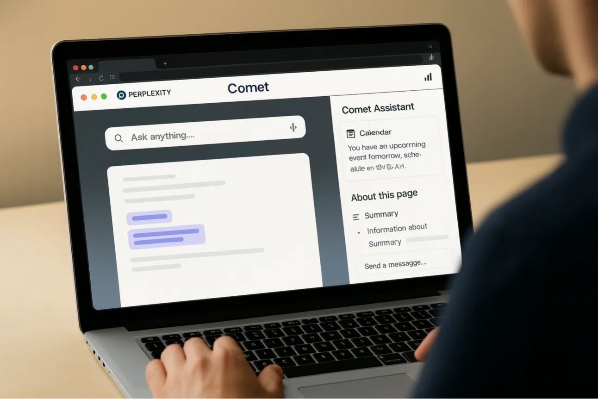

# Perplexity推出Comet浏览器：内置AI助手，能看懂网页还能帮你干活

---

你每天打开浏览器，是为了找信息、处理邮件、订机票、看日程。但你有没有想过，浏览器本身能不能帮你做这些事？Perplexity刚推出的Comet浏览器就是这么想的——它不只是个"更快的Chrome"，而是把AI助手直接塞进了浏览器里。你在看什么网页，它就能看到什么；你想干什么，它就能帮你操作。听起来很酷，但实际用起来怎么样？我们来聊聊。

---

## Comet不是普通浏览器，它想当你的"网络操作系统"

周三，Perplexity正式发布了自己的浏览器Comet。CEO Aravind Srinivas说，这不是一个简单的浏览工具，而是一个"为好奇心设计的操作系统"——听起来有点玄，但翻译过来就是：它想成为你在网上思考、学习、行动的主要平台。

目前Comet只对两类人开放：每月付200美元的Max订阅用户，以及少数拿到内测邀请的人。这个定价和准入门槛，明显是在筛选"重度用户"——那些真的愿意为AI工具付费、并且愿意把日常工作流迁移到新浏览器的人。

## Comet Assistant：能看懂你正在看的网页

Comet的核心功能是它的AI助手——Comet Assistant。你可以在任何网页上打开一个侧边栏，助手就能"看到"你当前屏幕上的内容。然后呢？它能做这些事：

- 总结邮件或日历事件
- 分析社交媒体或文档内容
- 根据当前页面回答问题
- 建议下一步操作
- 填写表单、导航网页
- 管理标签页

关键是，你不用复制粘贴链接，也不用切换标签页。你只需要问它，或者告诉它你想干什么，它就能在你当前的工作流里直接操作。

比如，TechCrunch的测试中，Comet Assistant能在停车预订网站上输入日期，或者从日历事件里提取路线信息。这种"上下文感知"能力，是传统浏览器插件做不到的。

👉 [想体验这种"能看懂网页"的AI助手？点这里了解更多](https://pplx.ai/ixkwood69619635)

## 简单任务OK，复杂任务翻车

听起来很美好，但实际测试中，Comet Assistant的表现有点参差不齐。

对于简单、线性的任务——比如总结一封新闻邮件，或者提醒你下周有什么会议——它干得不错。但一旦任务变复杂，问题就来了。

有个测试是这样的：让助手帮忙预订停车位。结果它搞错了日期，然后继续往下走，用错误的信息完成了整个流程。当测试者让它重试时，它又犯了同样的错误。

这不是Comet独有的问题。OpenAI的Operator、其他AI代理工具，都有类似的毛病：它们能按步骤执行，但缺乏"判断力"——不知道什么时候该停下来检查，什么时候该自我纠正。

另外，Comet要求的权限也不少。为了让助手正常工作，你可能需要授权它访问你的屏幕内容、邮箱、日历、联系人。对于重度用户来说，这可能是值得的；但对于普通人来说，这种"全面开放"的要求，多少有点让人不安。

## Perplexity的野心：不只是搜索，而是整个浏览体验

Comet的推出，标志着Perplexity不再满足于做"更好的搜索引擎"。它想要的，是整个浏览器市场。

为什么？因为浏览器是用户数据的入口。你在网上看什么、搜什么、点什么、买什么，浏览器都知道。如果Perplexity能让用户把Chrome换成Comet，它就能直接获取这些数据，用来训练AI模型、优化产品、减少对第三方平台的依赖。

这不是Perplexity一家在做的事。其他公司也在抢这块蛋糕：

- The Browser Company在6月推出了Dia，同样带侧边栏AI功能
- Brave浏览器集成了总结和AI导航工具
- OpenAI据说也在开发自己的浏览器，还挖走了Chrome团队的核心工程师

但Chrome的统治地位依然稳固：全球超过30亿用户,市场份额超过65%。相比之下，Perplexity在2025年5月的查询量是7.8亿次，月增长率超过20%——增长很快，但体量还差得远。

## Comet的设计哲学：好奇心优先

在Comet的官网上，Perplexity强调了三个核心价值：

- **个性化**：Comet会适应你的思维方式，记住你感兴趣的东西
- **强大**：Perplexity的AI能力在每个页面上都可用
- **高效**：每周能帮你节省几小时，自动处理笔记、日历准备、邮件审查

这套话术，明显是在和传统浏览器的"标签页+搜索栏+书签"模式划清界限。Comet想做的，不是一个"更快的工具",而是一个"会思考的伙伴"。

## 快问快答

**Q: Comet是什么？**  
A: Perplexity推出的AI浏览器，把AI搜索和AI助手功能整合在一起。

**Q: 谁能用？**  
A: 目前只对Max订阅用户（200美元/月）和少数内测用户开放。你可以加入等待名单。

**Q: 它和Chrome有什么不同？**  
A: Comet Assistant能"看到"你当前的网页，并根据内容执行任务——比如总结邮件、填写表单、管理标签页。

**Q: 有什么局限？**  
A: 简单任务表现不错，但复杂的多步骤操作容易出错，缺乏自我纠正能力。

**Q: 需要什么权限？**  
A: 根据功能不同，可能需要访问邮箱、日历、联系人和屏幕内容。

## 这意味着什么？

Comet不只是一个产品发布，它代表了一个更大的趋势：AI正在从"工具"变成"界面"。

以前，我们用浏览器访问网站，用搜索引擎找信息，用插件增强功能。现在，AI想把这些环节都整合起来——你不用再"找信息",而是直接"问问题"；你不用再"手动操作",而是直接"下指令"。

但这也带来了新的问题：当AI助手需要访问你的邮箱、日历、屏幕内容时，你愿意给它多大的权限？当它犯错时，你能接受吗？当它变得越来越"不可或缺"时，你会不会担心自己对它的依赖？

Comet现在还只是个开始。它能不能真正挑战Chrome，取决于两件事：一是它的AI助手能不能变得更聪明、更可靠；二是用户能不能信任它。

---

## 结语

Comet的推出，标志着Perplexity从"搜索工具"向"浏览平台"的转型。它不只是想做一个更好的搜索引擎，而是想重新定义我们和互联网的交互方式。对于那些每天需要处理大量信息、希望提高效率的人来说，👉 [Comet可能是个值得尝试的选择](https://pplx.ai/ixkwood69619635)。但它能不能真正取代Chrome，还得看它能不能在"强大"和"可靠"之间找到平衡。
